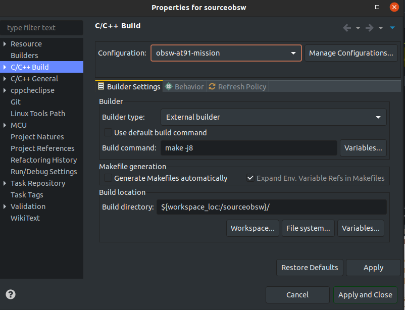
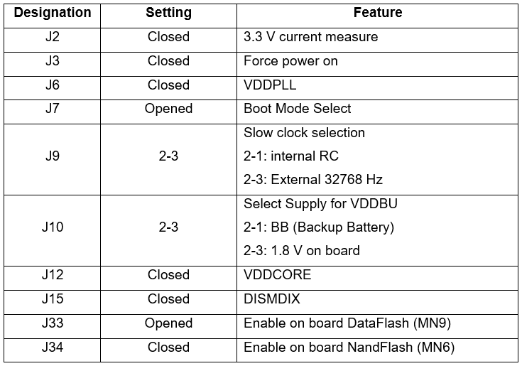
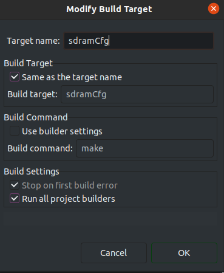
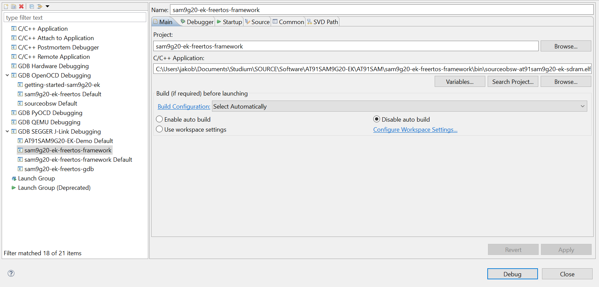
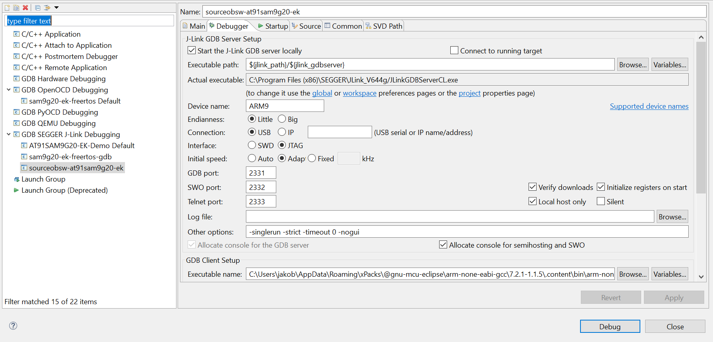
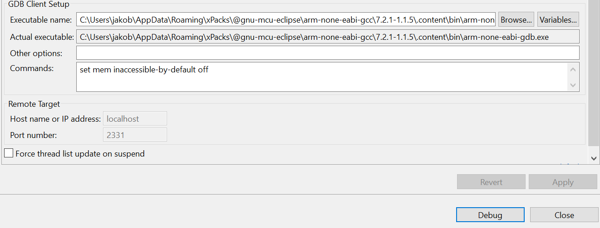
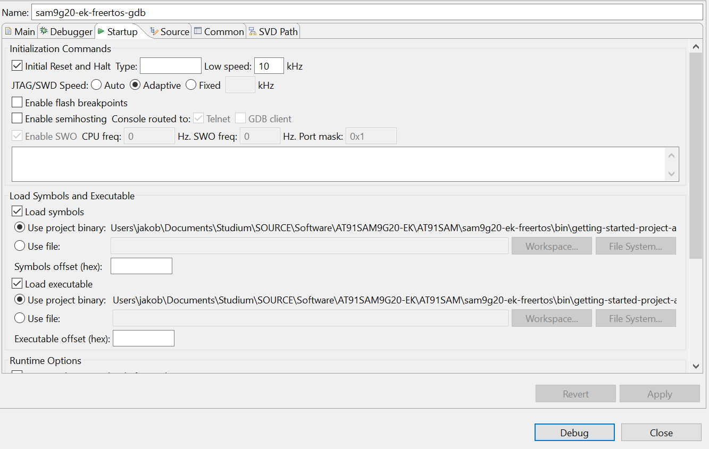
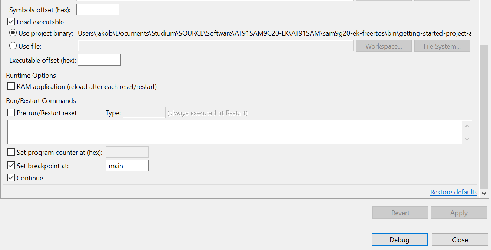

# <a id="top"></a> <a name="at91"></a> AT91SAM9G20-EK getting started

## Options to execute binaries on board

The AT91SAM9G20-EK board is similar to the iOBC but lacks some of the peripherals
located on the iOBC. Unless `BOARD_IOBC=1` is specified in the build system generation command,
the generated binary will be built for the AT91SAM9G20-EK development board.
There are two options to flash the AT91 board with the built software:

1. Flash the SDRAM directly using either SAM-BA or loading it with a SEGGER debugger probe.
   For development purposes, it is recommended to use a SEGGER debugger probe and set up the
   Eclipse environment for convenient debugging.

2. Flash the binary to the non-volatile NAND-Flash memory. This also required a bootloader or
   two bootloaders (depending on configuration) to be loaded to the NAND-Flash memory as well.

## Flashing the SDRAM directly

### SAM-BA

When using SAM-BA and there is executable code located on the NOR-Flash, it might be necessary to
disconnect Jumper J34 so the internal ROM-Boot program jumps to SAM-BA boot. After sending the image
to the SDRAM, use `go 0x20000000` in SAM-BA to jump to the application.

### SEGGER J-Link

When using `arm-none-eabi-gdb` and the SEGGER J-Link, the `sdramCfg` make build target should be 
executed to configure the SDRAM before flashing it. Instruction to set up Eclipse for convenient 
software development can be found below. This is the recommended way to develop and flash software.

## Flashing the non-volatile NAND-Flash with the bootloaders

There are basically two bootloader options:

- Single-stage bootloader at NAND-Flash address 0x0, which loads the primary image from NAND-Flash
  0x20000 to the SDRAM start address 0x20000000 and jump there.
- Two-stage bootloader, consisting of aforementioned first-stage bootloader at NAND-Flash address 
  0x0 and a second stage-bootloader at address 0x20000. The first-stage bootloader will load the 
  second-stage bootloader from address 0x20000 to SDRAM location 0x20100000. The second-stage 
  bootloader will then load the primary image from NAND-Flash address 0x40000 or from the SD-Card to
  the start of the SDRAM at address 0x20000000.
  
It should be noted that the sixth ARM vector of the first-stage bootloader needs to be replaced
by the binary size. Depending on the type of bootloader used, the primary software image needs to 
be recompiled as well (if upload is done via USB interface).
The bootloader type can be set in the `sam9g20/common/commonConfig.h` configuration file. 

Currently, while FreeRTOS support is implemented in the second-stage bootloader, there are issues
when running FreeRTOS in the function to start the first task (either in second-stage bootloader
or in primary image subsequently, the program just crashes for unknown reasons). 
Therefore, it is recommended to disable FreeRTOS.

The following command can be used to build the first-stage bootloader

```sh
mkdir build-Mission-BL-AT91EK && cd build-Mission-BL-AT91EK
cmake -DBOOTLOADER=ON -DCMAKE_BUILD_TYPE=MinSizeRel .. 
cmake --build . -j
```

The following command can be used to build the second-stage bootloader

```sh
mkdir build-Debug-BL2-AT91EK && cd build-Debug-BL2-AT91EK
cmake -DBOOTLOADER=ON -DBL_STAGE_TWO=ON -DCMAKE_BUILD_TYPE=Debug .. 
cmake --build . -j
```

The bootloaders can be uploaded to the NAND-Flash using either SAM-BA or the USB/RS232 interface 
and the Python `tmtc` commander.

### SAM-BA

When using SAM-BA, take care to use the `Send Boot File` option and enabling the NAND-Flash before
performing anything else. The RomBoot program will expect the binary size written to the sixth ARM
vector of the bootloader (address 0x14) and SAM-BA will take care of that.
It will copy the first-stage bootloader to the SRAM and then execute the bootloader
there. 

### USB / RS232 Interface

The SOURCE OBSW is able to receive software or bootloader updates via the UART interface. This 
requires an SD-Card in slot 1 of the development board. The binary upload mode of the `tmtc` Python 
software is used to send the binary and offers various PyCharm run configurations to do write 
binaries to the NAND-Flash. The PUS standard is used as a packet format to closely resemble the 
update procedure used during satellite operations. Simply load the `tmtc` folder as a PyCharm 
project. Steps:

1. Create a generic folder structure on the SD-Card. There is a special run configuration to do this.

2. Use the Binary Upload Command of the `tmtcclient`. The OBSW will take care of writing the binary 
   size to the sixth ARM vector. The binaries will first be written to the SD-Card and can then be 
   written to the NAND-Flash using a special command provided by the Python software.

3. Write the bootloader or the OBSW Update to the NAND-Flash using the respective Python command. 
   There are options to chose whether the first-stage bootloader, the second-stage bootloader
   or the primary image is uploaded.

4. Power cycle the board manually  or use the PyCharm board reset command to test
   the flashed software.  Ensure that Jumper J34 is placed so RomBOOT checks the NAND-Flash for the 
   bootloader  

## Setting up Eclipse to execute the Makefile and flash the software

### Setting up Eclipse build configurations

1. Right click on project sourceobsw-at91sam9g20-ek &rarr; Properties &rarr; 
   C/C++ Build &rarr; . Here, common build commands can be stored as build configurations.


2. Now software can be built by clicking the hammer symbol
3. Please note that Eclipse CDT has own environmental variables (which are 
   deduced from the native ones normally). If there are some issues running the 
   SDRAM configuration, check whether the used executables are included in the 
   environment variables by going to the project settings (right click project   &rarr; Properties) 
   to C/C++ Build &rarr; Environment and checking 
   the PATH. The settings will only be applied to the current configuration unless 
   AllConfigurations is selected above. Also make sure that the ARM Toolchain was 
   added to the system environment variables (or add them to the Eclipse environment variables).

### Preparation to load software using the J-Link
1. Install J-Link ARM software from [their website](https://www.segger.com/downloads/jlink/#J-LinkSoftwareAndDocumentationPack)
2. Check if arm-none-eabi-gdb.exe is found. Otherwise add path to system 
   environement variables. Should already have been installed earlier by
   ```sh
   xpm install --global @xpack-dev-tools/arm-none-eabi-gcc@latest
   ```

   On Windows, MSYS2 should have been installed to allow Makefile build generation.
   Otherwise, you can also install Windows Build Tools with `xpm` as well (and add the path
   to the system environment variables as well)
   
   ```sh
   xpm install --global @xpack-dev-tools/windows-build-tools@latest
   ```

3. Check jumpers on the board. Should be set as follows



4. Connect J-Link to USB port of host computer
5. Connect J-Link to AT91SAM9G20-EK
6. Power on AT91SAM9G20-EK
8. Execute `./sdramCfg.sh` to configure the sdram. Can be done in a shell like MinGW64




### Start J-Link debugging session from Eclipse
1. Right click on project &rarr; Debug As &rarr; Debug Configurations...
2. In the shown menu right click GDB SEGGER J-Link Debugging &rarr; new
3. Insert in field "C/C++ Application" sourceobsw-at91sam9g20-ek-sdram.elf file (located in bin directory)
4. Set up the debugger as shown in the following pictures. It is important that the 
   path to the JLinkGDBServerCL.exe and the arm-none-eabi-gdb.exe are set corretly. 
   If the ARM Toolchain has and the J-Link Software folder have been added to the 
   system environment variables (which is recommended), it should be sufficient to only specify 
   the .exe file without the full path.
5. Now, image can be written to the at91sam9g20-ek by clicking the "Debug"-button
6. Open up Eclipse Terminal/Arduino IDE/Puttty with baud rate 115200 to read debug output

#### Main



#### Debugger




#### Startup



<br>

