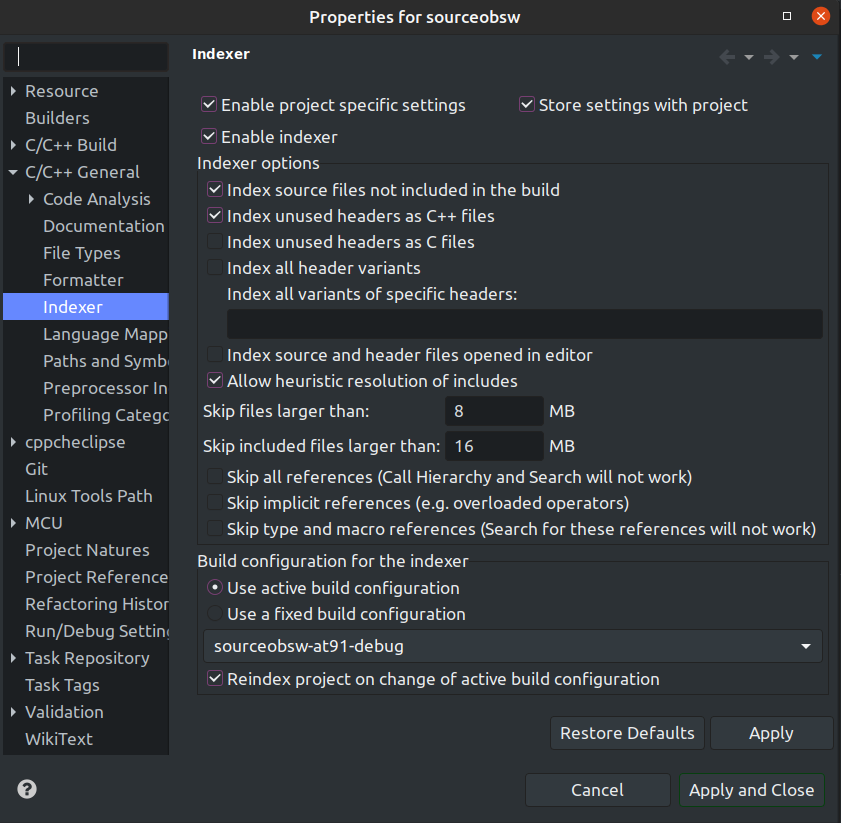
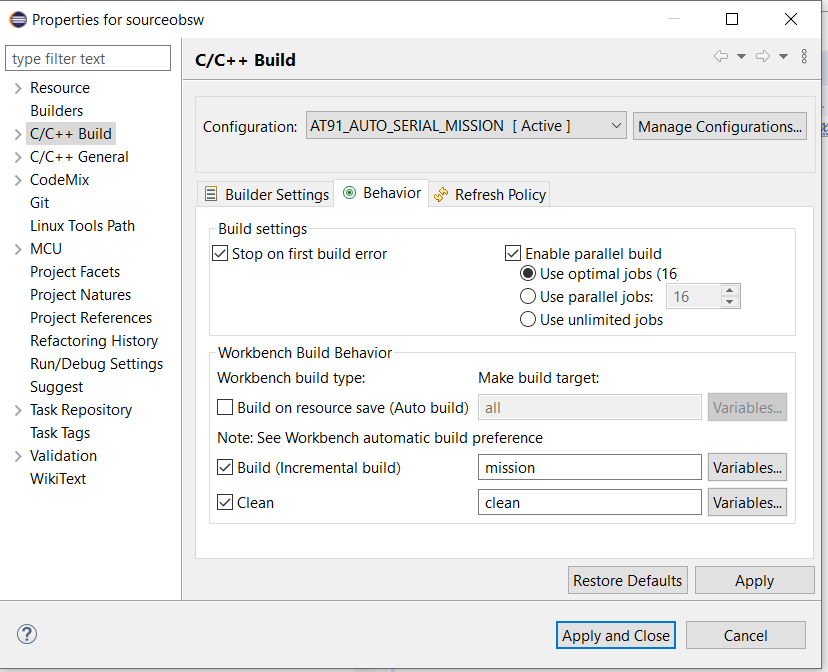

## <a id="top"></a> <a name="at91"></a> AT91SAM9G20-EK getting started

### Setting up eclipse to execute the makefile
1. Right click on project sourceobsw-at91sam9g20-ek &rarr; Properties &rarr; C/C++ Build &rarr; use as build command (wsl can be omitted if Windows Build Tools was installed): wsl make -j4. 


2. Now software can be built by clicking the hammer symbol
3. Please note that Eclipse CDT has own environmental variables (which are deduced from the native ones normally). If there are some issues running the SDRAM configuration, check whether the used executables are included in the environment variables by going to the project settings (right click project->Properties) to C/C++ Build -> Environment and checking the PATH. The settings will only be applied to the current configuration unless AllConfigurations is selected above. Also make sure that the ARM Toolchain was added to the system environment variables (or add them to the Eclipse environment variables).

### Loading Software to AT91SAM9G20-EK
1.	Install J-Link ARM software from https://www.segger.com/downloads/jlink/#J-LinkSoftwareAndDocumentationPack (on windows)
2. Check if arm-none-eabi-gdb.exe is found. Otherwise add path to system environement variables. Should already have been installed earlier by
````sh
xpm install --global @gnu-mcu-eclipse/arm-none-eabi-gcc
````
3. Check jumpers on the board. Should be set as follows


4.	Connect J-Link to USB port of host computer
5.	Connect J-Link to AT91SAM9G20-EK
6.	Power on AT91SAM9G20-EK
7. Execute make sdramCfg to configure the sdram. Can be done by creating a new target: Right click project &rarr; Build Targets &rarr; change build command to:<br />
wsl make -j4


### Start J-Link debugging session from Eclipse
1. Right click on project &rarr; Debug As &rarr; Debug Configurations...
2. In the shown menu right click GDB SEGGER J-Link Debugging &rarr; new
3. Insert in field "C/C++ Application" sourceobsw-at91sam9g20-ek-sdram.elf file (located in bin directory)
4. Set up the debugger as shown in the following pictures. It is important that the 
   path to the JLinkGDBServerCL.exe and the arm-none-eabi-gdb.exe are set corretly. 
   If the ARM Toolchain has and the J-Link Software folder have been added to the 
   system environment variables (which is recommended), it should be sufficient to only specify the .exe file without the full path.
5. Now, image can be written to the at91sam9g20-ek by clicking the "Debug"-button
6. Open up Eclipse Terminal/Arduino IDE/Puttty with baud rate 115200 to read debug output

#### Main


#### Debugger


#### Startup


<br>

##  Setting up Eclipse environment for build targets
### Example environment

<a name="buildtargets"></a>
The Eclipse environment uses the previously mentioned build targets. 
Build targets can be created by right clicking on sourceobsw &rarr; Build Target &rarr; Create. 
Also make sure the toolchain is included like seen in the following picture by going to 
C/C++ Build &rarr; Settings, checking that the paths for the ARM Toolchain are set correctly 
and hitting Apply. This ensures that the Eclipse indexer finds standard libraries.
If this does not work, right click on sourceobsw &rarr; Properties &rarr; C/C++ General &rarr; Indexer and enable project specific settings. 
It is also recommended to use the active build configuration and rebuild the index on build configuration change.


<br>
<br>

Example indexer settings:

<br>

### Example Build Configuration.

Please note that this is just an example and a display of how to use
Eclipse to make development as convenient as possible.
There is a distinction between build configurations and launch configurations in Eclipse.

1. Build configurations should be setup separately (e.g. one for release and one 
   for debug build, target and used cores can be specified in the Behaviour tab), and built once. 
2. After that the built binary can be selected in the launch configuration. 
   There are different launch configuration types provided by Eclipse, depending 
   on whether the binary needs to be uploaded to an external development board 
   or is simply executed on the host machine directly.
   For the AT91 board, the SEGGER J-Link Debug Launch Configuration is used and has 
   to be configured appropriately (see sections above).
3. After setting up the build configurations, building and debugging should be 
   easy by only having to click the hammer or the bug icon.
4. A double click on the build targets in the left panel can also be used to 
   execute the target for the current build configuration, which can be set in 
   the top panel next to the cog.




