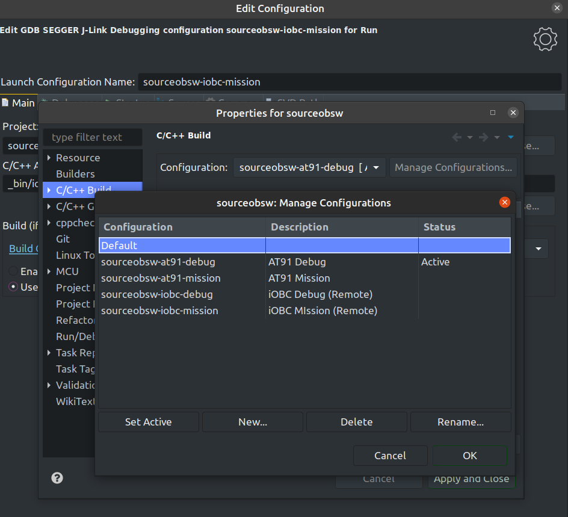

#  Setting up Eclipse environment for build targets

### General information
Eclipse is a major IDE used for various programming languages. While it might
be better known as an IDE for Java development, it is possible to develop
C and C++ code (for Desktop or for microcontrollers) with the right plugins and 
extensions. Eclipse is a very useful tool to ease development and provides 
tools like a powerful project indexer and various ways to conveniently build, 
run and debug software on either the desktop or on embedded systems connected 
via J-Link or USB.

However, it is also somewhat cumbersome and difficult to set up for beginners.
Therefore, some recommended starting points will be given to set up Eclipse
properly for convenient development.

### Installation Eclipse for C/C++ Developers on Windows

1. Install JDK if not installed yet. Eclipse requires 
[Java SE Platform (JDK)](https://www.oracle.com/technetwork/java/javase/downloads/index.html)
2. Install [Eclipse for C/C++ Developers](https://www.eclipse.org/downloads/packages/)
3. Go to Menu -> Help -> Eclipse Marketplace and search and install GNU MCU Eclipse

### Recommended steps

Makefile projects are generally imported by using File &rarr; New &rarr; Other
&rarr; Makefile project with existing code and then importing the folder cloned
from git.
After that, it is recommended to perform following project configuration steps:
1. Right click on the project folder in the Project Explorer panel left 
   and go to Properties
2. Go to C/C++ General and enable Doxygen as the documentation tool
3. Go to C/C++ Build &rarr; Indexer. It is recommened to enable project specific
   settings, use the active build configuration and rebuild the index
   on build configuration change.

Example indexer settings:
 

Special steps if developing for a MCU (like the AT91 or the iOBC) and using
a special toolchain:

1. Install the Eclipse MCU Plugin from the Eclipse Marketplace by going to
   Help &rarr; Eclipse Marketplace
2. Install the ARM Toolchain (explained in main README) and add it to the
   path variables. After that, go to Project Properties &rarr; MCU and make sure
   the Toolchain is found by Eclipse.
3. Make sure the toolchain is included like seen in the following picture by going to 
   C/C++ Build &rarr; Settings, checking that the paths for the ARM Toolchain are 
   set correctly and hitting Apply. The Eclipse MCU plugin needs to be installed
   for this to work.
   

### Example Build Configuration.

The Eclipse environment uses the previously mentioned build targets. 
Build targets can be created by right clicking on sourceobsw &rarr; Build Target &rarr; Create. 
Please note that this is just an example and a display of how to use
Eclipse to make development as convenient as possible.
There is a distinction between build configurations and launch configurations in Eclipse.

1. Build configurations should be setup separately (e.g. one for release and one 
   for debug build, target and used cores can be specified in the Behaviour tab), and built once. 
2. After that the built binary can be selected in the launch configuration. 
   There are different launch configuration types provided by Eclipse, depending 
   on whether the binary needs to be uploaded to an external development board 
   or is simply executed on the host machine directly.
   For the AT91 board, the SEGGER J-Link Debug Launch Configuration is used and has 
   to be configured appropriately (see sections above).
3. After setting up the build configurations, building and debugging should be 
   easy by only having to click the hammer or the bug icon.
4. A double click on the build targets in the left panel can also be used to 
   execute the target for the current build configuration, which can be set in 
   the top panel next to the cog.

