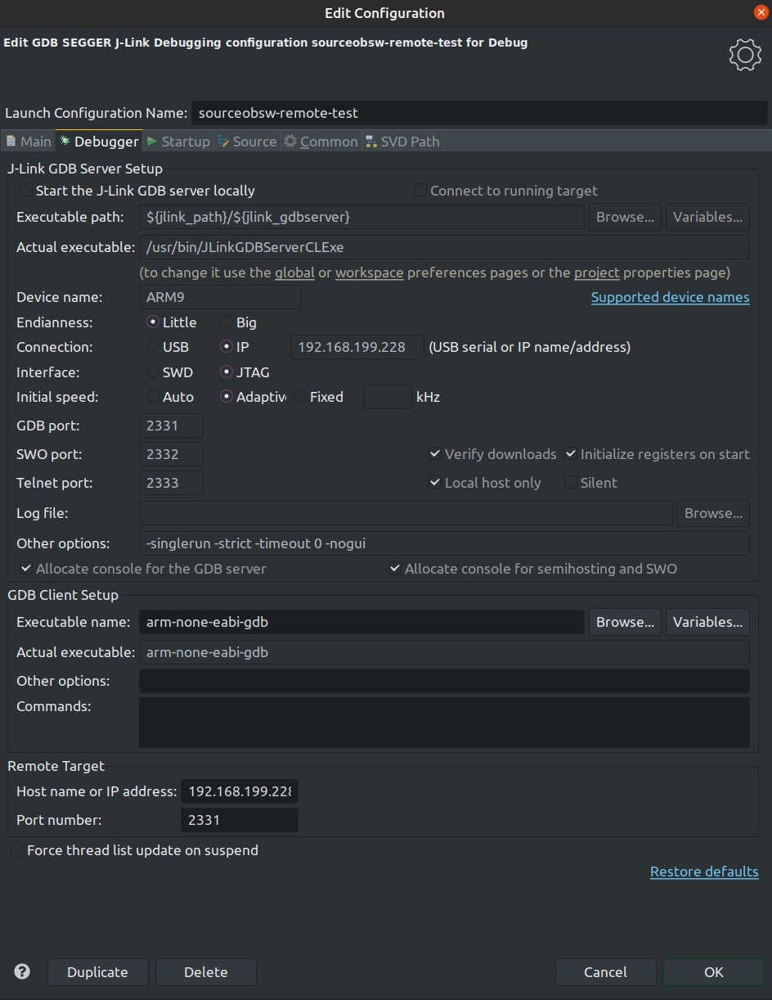
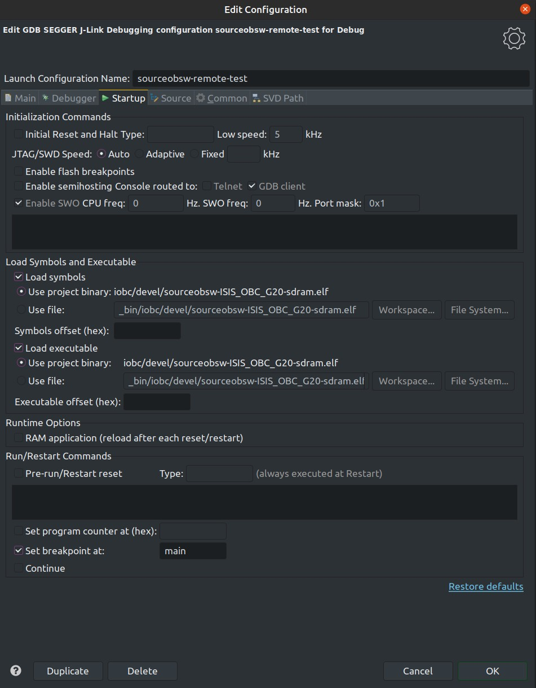
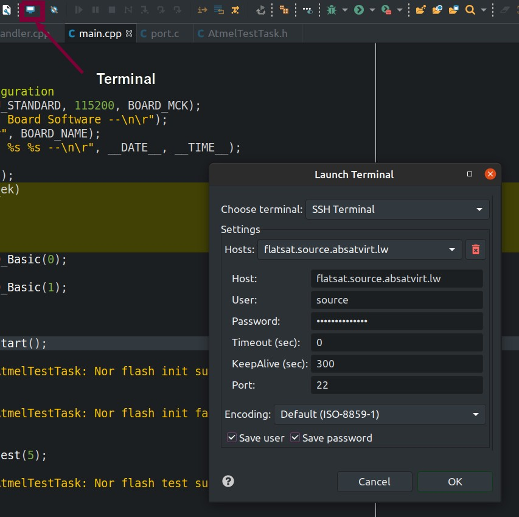

<a id="top"></a> <a name="flatsat"></a> 

## Common commands
When building on the flatsat computer directly, it is recommended to add
ADD\_CR=1 so that debug output is readable.
 
Build software for debugging
```sh
make debug IOBC=1 -j
```

Build release software
```sh
make mission IOBC=1 -j
```

Build bootloader
```sh
make mission -f Makefile-Bootloader IOBC=1 -j
```

## Basic instructions for Flatsat

### Connecting to the flatsat computer
1. Set up VPN, [IRS  mail account](https://cube18.irs.uni-stuttgart.de/) required: 
Write mail to zert@irs.uni-stuttgart.de to get OpenVPN configuration.
2. Download OpenVPN and configure it with the configuratioon files.
 - Windows: Put configuration files into a certain folder (I don't know it anymore)
   or add the configuration.
 - Ubuntu: Install the ubuntu gnome version of OpenVPN. 
Then go to Network->VPN and press + to add the .ovpn file configuration
3. Connect to the VPN
4. Connect to Flatsat (password needed, ask Jonas Burgdorf on Mattermost):
```sh
ssh (-X) source@flatsat.source.absatvirt.lw
```
-X is optional for graphical applications
There is also another command for port forwarding
```sh
ssh -L <localPort>:localhost:<remotePort> source@flatsat.source.absatvirt.lw
```
to tunnel from <localPort> to the <remotePort> on the flatsat.

### Building software on flatsat computer
1. Navigate to obsw folder
```sh
obsw
```

2. JLink GDB server needs to run on the flatsat. It is run on standard port 2331
with tmux in the normal case. To check whether a tmux is active, use `tmux ls` .
If a tmux is active, check the status of the GDB server can be checked by using
`tmux a`, detaching from the tmux session and moving it to the background
is done by typing in `CRTL+D`, `:` and `detach`. To close the tmux session,
use `kill-session` instead. In some cases, it can becomes necessary to restart
the J-Link GDB Server. The GDB Server should be run with the following command

```sh
JLinkGDBServerCLExe -USB -device AT91SAM9G20 -endian little -if JTAG -speed auto -noLocalhostOnly 
```
Add a & at the end optionally to run it in the background. Background processes can be listed
with `ps -aux` and killed with `kill <processId>`

3. Binary can be built with
```sh
make IOBC=1 virtual -j2
```
Or mission instead of virtual for mission build.

4. Perform sdramCfg (only needs to be once after power cycle)
```sh
make sdramCfg
```

5. Open second shell session, connect to flatsat and run 
```sh
listenUsb0
```
This will only work if the dev path of the debug output
is /dev/ttyUSB0, which will usually be the case.
If it is not the case, the connected USB devices can be checked
with `listUsb`and a generic version can be used.
```sh
listenUsb <devPath> <baudRate>
```

6. Start GDB (the following steps can propably be automated, but I don't know how yet.)

```sh
arm-none-eabi-gdb
```

7. Set target in 

```sh
target remote localhost:2331
```

8. Load .elf file

```sh
load _bin/iobc/<folder>/<binarary>.elf
```
and press c to start

### Setting up Eclipse for remote development

1. The current IP address of the flatsat computer is 
192.128.199.228 . That address could change, and it can be checked
by logging into the flatsat like explained above and running:   
```sh
ifconfig    
```
  
It is also assumed the the JLinkGDBServerCLExe application
is already running on the interface computer (either directly
in a shell instance, in the background, or in a tmux)

2. The IP address is used to set up Eclipse for remote development.
A set-up build system for the on-board software in Eclipse is a
pre-requisite and is explained in [AT91SAM9G20 getting started](../sam9g20/README-at91.md#top)
inside the build target section. If the launch configuration has been set-up, it is simply copied by
clicking on "Duplicate" inside the launch configuration settings.

3. Setup a new build configuration. The only different to the AT91 builds
is the added `IOBC=1` make flag. Example make command for mission build
on Windows
```sh
make WINDOWS=1 IOBC=1 mission -j
```
Don't forget to select the binary after building it initially

4. The debugger tab should be set up like show below. The IP address
is the IP address of the iOBC interface computer and can be retrieved
like explained in point 1. 


5. The startup tab should be set up like below. Right now, the 
SAM-ICE can not handle monitor reset or monitor halt commands
and the reason is unknown.


6.  The serial output from the iOBC can be read from the dev path of the
interface computer directly. It is possible in Eclipse to open a ssh
session like shown in the following picture.


After that, the output can be display by running these commands
in the ssh session:
```sh
listenUsb0 
```

There is also a generic version to listen to USB ports:
```sh
listenUsb <DevPath> <baudRate>
```

All dev paths can be listed with the command

```sh
listUsb
```

These scripts are located inside the scripts folder.


