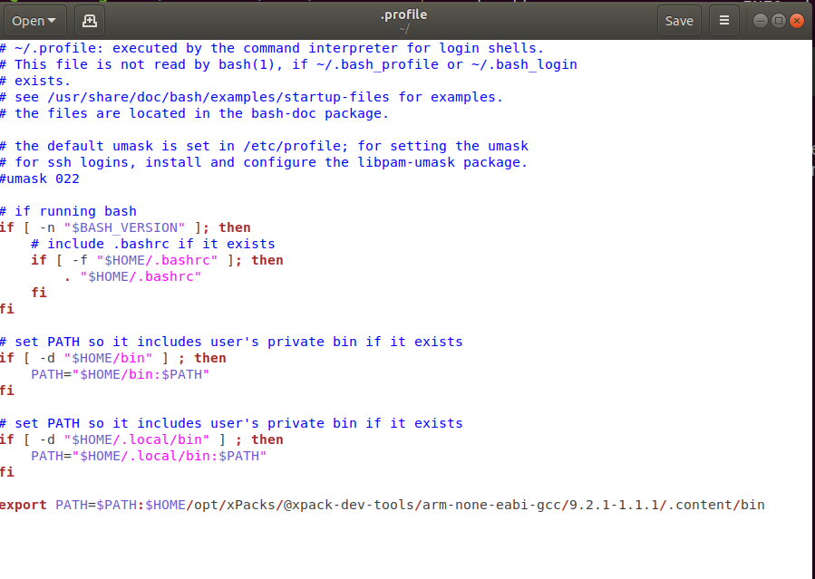
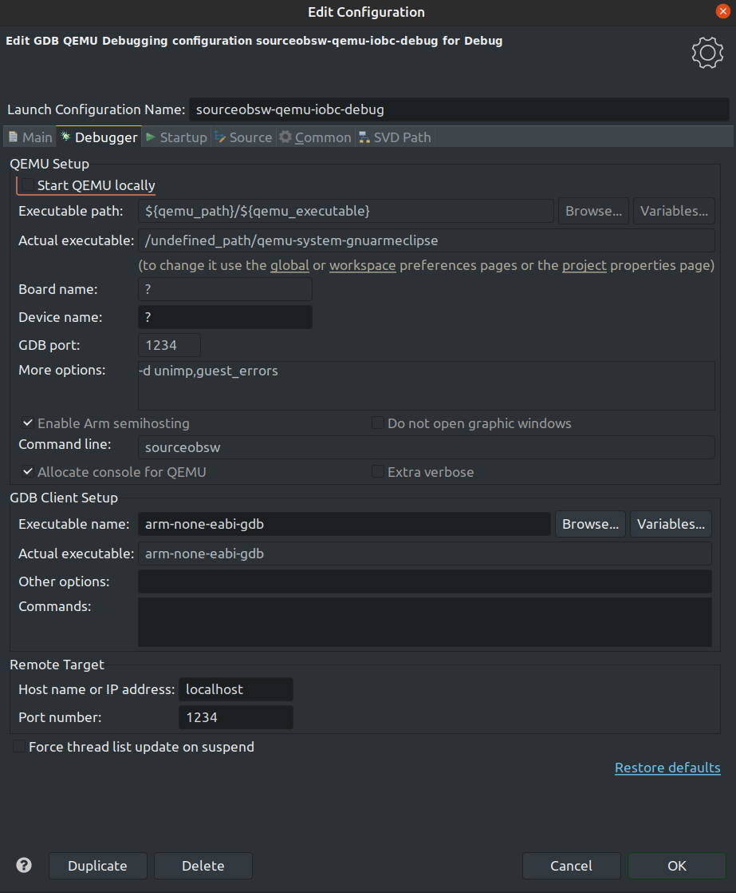

# <a id="top"></a> <a name="qemu"></a> QEMU
Refer to the [QEMU repository installation](https://git.ksat-stuttgart.de/source/obc-qemu) and follow 
the installation instructions.
Please note that this repository should be cloned in the same directory in which the SOURCE OBSW repository was cloned.
Otherwise, the StartQEMU.sh start-up script won't work.
After that, start the script in a new terminal instance with
```sh
./StartQEMU.sh
```
This should start the emulation of the iOBC in the terminal session.
By default, the emulation will wait for a debugger connection.
Please ensure that the right binary for the iOBC or AT91 development board
was built and is located in the \_bin folder.

There are also additional arguments for the scripts.
If the emulation should start immediately without waiting for the debugger,
run
```sh
./StartQEMU.sh no-wait
```

If there are multiple binaries available (for example mission and debug),
the debug binary will be chosen by default. To chose the mission binary, run
```sh
./StartQEMU.sh <no-wait or some other string/number> mission
```

## Set up eclipse for QEMU debugging
After the QEMU set-up has been completed (it is recommended to test it with the shell script),
eclipse can be set-up to perform debugging. It is recommended to have a look at 
the [AT91SAM9G20 getting started](../sam9g20/README-at91.md#setting-up-eclipse-environment-for-build-targets)<br> build configuration set-up
to enable automated building.


1. It is recommended to add the ARM toolchain to the PATH / environment variables.
   Example .profile file configuration for Ubuntu 18.04: <br>
   
2. Go to Help->Eclipse Marketplace and install the Eclipse MCU plug-in if not already done so.
3. After that, go to Run->Debug Configurations.. and create a new GDB QEMU Debugging Configurations.
4. Go to the Configuration Editor by selecting the created debug configuration in the top left selector and clicking the
   settings button next to it. <br>
   
   
   Then go to Debugger. Make sure that the  Start QEMU locally option is not selected.
   
   Also make sure that arm-none-eabi-gdb is used as the debugging executable. If the binary folder of the ARM toolchain has been not added to the system environmental variables, the full path has to be specified.
   
   <br>
   <br>
   <br>
5. Compile the software by pressing the build button if a proper build configuration has been set-up. <br>
   Example build configuration as specified in [eclipse build configuration guide](../sam9g20/README-at91.md#setting-up-eclipse-environment-for-build-targets)<br>: 
   
   

5. Start the QEMU emulation in a separate terminal windows by running the shell script StartQEMU.sh
   ```sh
   ./StartQEMU.sh
   ```
6. Start the debugging session by selecting Debug at the top left selection window and pressing the bug.
